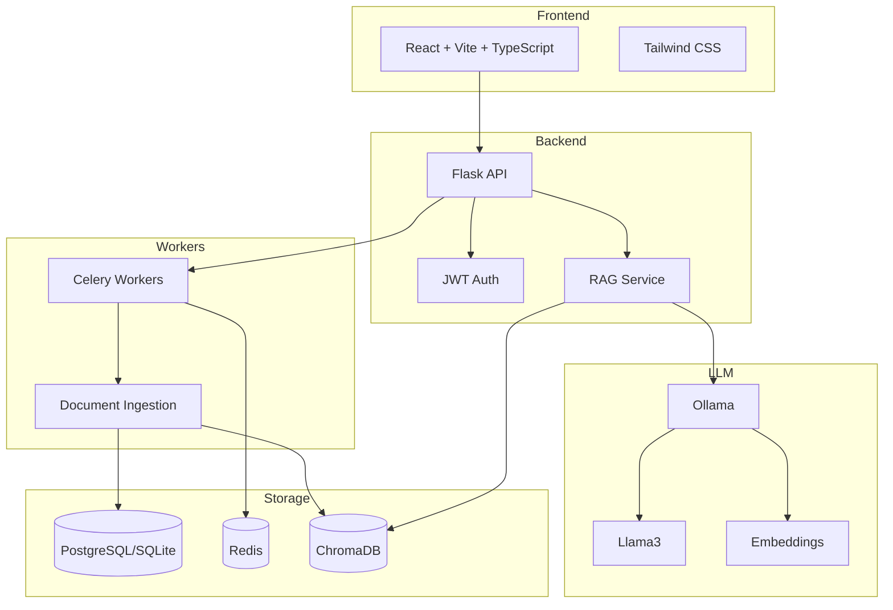

# InternalKnowledgeHub

A production-grade internal knowledge management system that allows employees to ask questions about internal documents and receive grounded answers with exact page/paragraph citations.

## 🎯 Features

- **Hybrid RAG Pipeline**: Dense (embeddings) + Sparse (BM25) retrieval with cross-encoder re-ranking
- **Document Ingestion**: Support for PDF, DOCX, MD, TXT files with async processing
- **LLM Integration**: Ollama with Llama3 for completely local, air-gap compatible deployment
- **Role-Based Access**: Admin, Editor, Viewer roles with JWT authentication
- **Citation Tracking**: Exact page/paragraph citations for every answer
- **Feedback Loop**: Thumbs up/down for continuous improvement
- **100% Open Source**: No paid APIs, CPU-friendly, < 4GB RAM

## 🏗️ Architecture



## 🚀 Quick Start

### Prerequisites

- Docker & Docker Compose
- Git
- 8GB+ RAM recommended (4GB minimum)

### Installation

```bash
# Clone the repository
git clone https://github.com/your-org/InternalKnowledgeHub.git
cd InternalKnowledgeHub

# Copy environment file
cp .env.example .env

# Start all services
make up

# Or without make:
docker-compose up -d
```

### Access Points

| Service | URL |
|---------|-----|
| Frontend | http://localhost:80 |
| API | http://localhost:8000 |
| API Docs | http://localhost:8000/docs |
| Ollama | http://localhost:11434 |

### Default Admin Credentials

```
Email: admin@internal.local
Password: changeme123
```

## 📁 Project Structure

```
InternalKnowledgeHub/
├── frontend/                 # React + Vite + TypeScript
│   ├── src/
│   │   ├── api/             # Axios wrappers
│   │   ├── components/      # React components
│   │   ├── hooks/           # Custom hooks
│   │   ├── pages/           # Page components
│   │   ├── store/           # Zustand state
│   │   └── types/           # TypeScript types
│   ├── public/
│   └── package.json
├── backend/
│   ├── app/
│   │   ├── api/             # Flask blueprints
│   │   ├── core/            # Config, security, db
│   │   ├── crud/            # Database operations
│   │   ├── models/          # SQLAlchemy models
│   │   ├── schemas/         # Pydantic schemas
│   │   ├── services/        # Business logic
│   │   └── main.py          # Flask app
│   ├── migrations/          # Alembic migrations
│   ├── tests/               # Pytest tests
│   ├── requirements.txt
│   └── Dockerfile
├── worker/
│   ├── tasks.py             # Celery tasks
│   └── Dockerfile
├── docker-compose.yml
├── .github/workflows/ci.yml
├── Makefile
└── README.md
```

## 🔧 Configuration

### Environment Variables

| Variable | Description | Default |
|----------|-------------|---------|
| `SECRET_KEY` | JWT secret key | (required) |
| `DATABASE_URL` | Database connection string | `sqlite:///./data/app.db` |
| `REDIS_URL` | Redis connection string | `redis://redis:6379/0` |
| `OLLAMA_HOST` | Ollama API host | `http://ollama:11434` |
| `OLLAMA_MODEL` | LLM model name | `llama3` |
| `OLLAMA_EMBED_MODEL` | Embedding model | `nomic-embed-text` |
| `CHROMA_PATH` | ChromaDB persistence path | `./data/chroma` |
| `UPLOAD_PATH` | File upload directory | `./data/uploads` |
| `JWT_ACCESS_EXPIRES` | Access token expiry (minutes) | `15` |
| `JWT_REFRESH_EXPIRES` | Refresh token expiry (days) | `7` |

### Swapping LLM Models

```bash
# Pull a different model
docker exec -it ollama ollama pull mistral:7b

# Update .env
OLLAMA_MODEL=mistral:7b

# Restart backend
docker-compose restart backend worker
```

### Low VRAM Mode

For systems with limited GPU memory:

```bash
# In .env
OLLAMA_KEEP_ALIVE=0
OLLAMA_NUM_GPU=0
```

## 🧪 Testing

```bash
# Run all tests
make test

# Backend tests only
make test-backend

# Frontend tests only
make test-frontend

# With coverage
make coverage
```

## 📚 API Documentation

### Authentication

```bash
# Register
POST /api/auth/register
{
  "email": "user@example.com",
  "password": "securepass123",
  "name": "John Doe"
}

# Login
POST /api/auth/login
{
  "email": "user@example.com",
  "password": "securepass123"
}
# Returns: { "access_token": "...", "refresh_token": "..." }

# Refresh Token
POST /api/auth/refresh
Authorization: Bearer <refresh_token>
```

### Documents

```bash
# Upload document
POST /api/documents
Content-Type: multipart/form-data
file: <file>

# List documents
GET /api/documents

# Get document status
GET /api/documents/{id}
```

### Ask Questions

```bash
# Ask a question
POST /api/ask
{
  "question": "What is the vacation policy?",
  "top_k": 5,
  "alpha": 0.7
}
# Returns: { "answer": "...", "citations": [...], "session_id": "..." }
```

### Feedback

```bash
# Submit feedback
POST /api/feedback
{
  "qa_id": "uuid",
  "thumb": "up"  # or "down"
}
```

## 🔒 Security

- JWT access tokens expire in 15 minutes
- Refresh tokens expire in 7 days
- Passwords hashed with bcrypt
- Role-based access control (Admin/Editor/Viewer)
- CORS hardened for production
- Input sanitization and validation

## 🐳 Docker Services

| Service | Image | Port |
|---------|-------|------|
| frontend | nginx:alpine | 80 |
| backend | python:3.11-slim | 8000 |
| worker | python:3.11-slim | - |
| db | postgres:15-alpine | 5432 |
| redis | redis:7-alpine | 6379 |
| ollama | ollama/ollama | 11434 |
| chroma | chromadb/chroma | 8001 |

## 🛠️ Development

```bash
# Start in development mode
make dev

# Run linting
make lint

# Format code
make format

# Build images
make build
```

## 📊 Acceptance Criteria

- ✅ Upload 10MB PDF → processed within 30s on 4-core CPU
- ✅ Question with answer on page 4 → citation contains page 4
- ✅ Answer latency < 3s (excluding LLM think time)
- ✅ Thumbs feedback stored and shown in admin stats
- ✅ JWT expires in 15 min, refresh in 7 days
- ✅ Unit tests > 80% coverage
- ✅ All services healthy via docker-compose

## 📄 License

MIT License - See LICENSE file for details.

## 🤝 Contributing

1. Fork the repository
2. Create a feature branch
3. Commit your changes
4. Push to the branch
5. Create a Pull Request

## 🆘 Troubleshooting

### Ollama not starting
```bash
# Check logs
docker logs ollama

# Ensure model is pulled
docker exec -it ollama ollama pull llama3
```

### Database migration issues
```bash
# Reset database
make db-reset

# Run migrations manually
docker exec -it backend flask db upgrade
```

### Out of memory
```bash
# Use smaller model
OLLAMA_MODEL=llama3:8b-instruct-q4_0

# Disable GPU
OLLAMA_NUM_GPU=0
```
